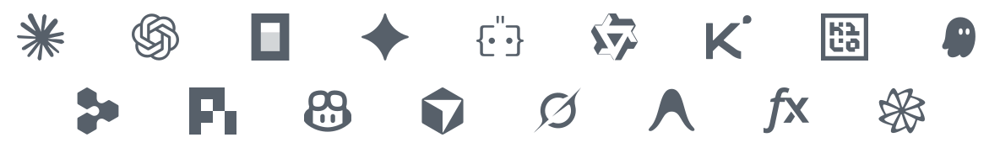

<div align="center">
  <picture>
    <source media="(prefers-color-scheme: dark)" srcset=".github/logotype-white.svg" />
    
  </picture>

  ### One control room for all your coding agents.

  **The way orchestrating agents should feel.<br />From your phone, desktop and browser.**

  Claude Code, Codex, OpenCode, Pi and more, working together and in parallel on your own machines. Sessions can spawn subagents across agents: e.g. Claude asking Codex for a review, or Codex delegating to Claude subagents. Switch agents mid-session. Approve, steer, review and commit from wherever you are.

  **Open source · Self-hostable · End-to-end encrypted**

  <p>
    <a href="#get-started">Get started</a> ·
    <a href="#downloads">Downloads</a> ·
    <a href="https://docs.happier.dev">Docs</a> ·
    <a href="#self-hosting">Self-host</a> ·
    <a href="https://discord.gg/W6Pb8KuHfg">Discord</a>
  </p>

  <p>
    <a href="LICENCE"></a>
    <a href="https://happier.dev/download"></a>
    <a href="https://discord.gg/W6Pb8KuHfg"></a>
    <a href="https://docs.happier.dev/releases"></a>
  </p>

  <a href="https://github.com/happier-dev/happier/discussions/226"><strong>Latest Happier project update</strong></a>

  <p>Happier is free and open source.<br />
    Your agents keep using the subscriptions and API keys you already have:<br />
    Claude Pro/Max, ChatGPT/Codex, API keys, or local models.</p>

  <p>
    
  </p>
  <p>
    
  </p>
</div>

## Get started

### 1. Install on your computer

The desktop app is the recommended way in: it sets up the CLI and the daemon for you.

<a href="https://happier.dev/download">
  <picture>
    <source media="(prefers-color-scheme: dark)" srcset=".github/download-desktop-white.svg" />
    
  </picture>
</a>
<br /><br />
<details>
<summary><b>Prefer the terminal?</b> Install the CLI and daemon without the desktop app</summary>

macOS/Linux:

```bash
curl -fsSL https://happier.dev/install | bash
```

Windows:

```powershell
iwr https://happier.dev/install.ps1 -useb | iex
```

If you specifically want the npm package instead: `npm install -g @happier-dev/cli` ([CLI docs](https://docs.happier.dev/apps/cli)).

</details>

<details>
<summary><b>Installing on a remote computer or devbox?</b> Set it up over SSH, from your machine</summary>

One command installs the CLI and the daemon on the remote host (release-signature verified) and registers it as one of your machines:

```bash
happier machine setup --ssh user@host
```

To sign the remote machine in without a browser on its side, run this from a machine where you are already signed in:

```bash
happier auth pair-remote --ssh user@host
```

Headless alternative on the remote host itself: `happier auth login --no-open --method web` prints an authorization URL you approve from any browser. [Machines and the daemon](https://docs.happier.dev/apps/daemon)

</details>

You sign in from the app, or on first run.

### 2. Add your phone

<table>
  <tr>
    <td align="center">
      <a href="https://happier.dev/appstore"></a>
    </td>
    <td align="center">
      <a href="https://happier.dev/playstore"></a>
    </td>
    <td align="center">
      <a href="https://happier.dev/apk"><b>Direct&nbsp;APK</b></a><br /><sub>stable release</sub>
    </td>
  </tr>
  <tr>
    <td align="center">
      <a href="https://happier.dev/appstore"><picture><source media="(prefers-color-scheme: dark)" srcset=".github/qr-app-store-white.svg" /></picture></a>
    </td>
    <td align="center">
      <a href="https://happier.dev/playstore"><picture><source media="(prefers-color-scheme: dark)" srcset=".github/qr-play-store-white.svg" /></picture></a>
    </td>
    <td align="center">
      <a href="https://happier.dev/apk"><picture><source media="(prefers-color-scheme: dark)" srcset=".github/qr-apk-white.svg" /></picture></a>
    </td>
  </tr>
</table>

Sign in with the same account and your sessions, machines and settings are already there.

### 3. Start a session

**In the app →** Press **New session**, pick the machine, the folder and the agent. No terminal needed.

**Or in the terminal**, from any project folder:

```bash
happier            # Claude Code
happier codex      # Codex
happier opencode   # OpenCode
```

Either way, the session shows up everywhere at once: keep typing in the terminal, follow along and approve from your phone, review in the browser. `happier --help` lists the other agents and commands.

## What you can do

### Run and coordinate agents

**Parallel sessions, on every machine you own.** Start as many sessions as you like and pick the machine, folder, agent and model for each one. Add a new machine over SSH from the app or the CLI. [Starting a session](https://docs.happier.dev/sessions/new-session-shortcuts) · [Machines and the daemon](https://docs.happier.dev/apps/daemon)

**Git worktrees, when you want them.** Start each session in its own Git worktree: a real checkout, its own branch, the same repository. Happier creates it from any local or remote branch, suggests a name, and offers to reuse an existing one instead of duplicating it. Or start in the folder you are already in; it is a choice per session, not a mode you switch on: all your sessions, none of them, or just this one. [New session options](https://docs.happier.dev/sessions/new-session-shortcuts)

**Prefer the terminal? Keep it.** Run Claude Code, Codex or OpenCode in their own terminal UIs: Happier mirrors those sessions to every device, so you can follow along, send messages and approve from anywhere, then switch between the terminal and the app whenever you like. [Claude unified terminal](https://docs.happier.dev/sessions/claude-unified-terminal)

**Your existing sessions? Already there.** Open any Claude Code, Codex or OpenCode session already running on your machine: live, from any device, nothing to migrate and nothing to learn. [Continuing a session](https://docs.happier.dev/sessions/continuing-a-session)

**Subagents across agents.** Any session can launch review, plan or delegate runs on another agent and read the results: Claude handing work to Codex subagents, Codex to Claude, or any other pairing. [Subagents](https://docs.happier.dev/extending/subagents)

**Switch agents mid-session.** Change the engine and the same session keeps going. A returning agent resumes its own thread and receives only what it missed. [Continue with another agent](https://docs.happier.dev/sessions/continue-with-another-agent)

**Hand a session to another machine.** Move a live Claude Code or OpenCode session to your desktop, a VPS or a dev box, and bring the working tree along if you want it. [Session handoff](https://docs.happier.dev/sessions/session-handoff)

**Queue it, steer it.** Queue messages while the agent works, reorder or edit them before they run, and steer a running turn without interrupting it. [Steering](https://docs.happier.dev/sessions/steering) · [Pending queue](https://docs.happier.dev/sessions/pending-queue)

### Review and ship

**Review diffs, line by line.** Browse your agent's changes, mark the exact lines you want addressed, and send the notes straight back: same session, or a new one. [Review comments](https://docs.happier.dev/code/review-comments)

**Git from any device.** Stage, commit, push, branch and open pull requests without leaving the app. [Git](https://docs.happier.dev/code/git)

**Files, editor, terminal.** Open any file in a real editor, and drop into a live terminal on the connected machine when you need a shell. [Files and editor](https://docs.happier.dev/code/files-and-editor) · [Embedded terminal](https://docs.happier.dev/extras/embedded-terminal)

### From anywhere

**An inbox for what needs you.** Permission requests, agent questions and unread sessions gather in one attention center across all sessions and machines, and push notifications open the exact session that asked. [Inbox and approvals](https://docs.happier.dev/sessions/inbox-and-approvals)

**A colleague you can talk to.** The voice assistant follows your running sessions, answers permission requests for you, and sends the messages you dictate. Bring your own ElevenLabs key or run a local voice pipeline. [Voice](https://docs.happier.dev/voice)

**Share a session.** Invite someone with view or edit access, or publish a read-only public link. [Session sharing](https://docs.happier.dev/accounts/session-sharing)

### Yours to run

**Every action, from every surface.** Everything Happier can do (create a session, send it a message, set the model, start a review) is defined once, in one registry. The app, slash commands, voice, in-session agents, the CLI and an external MCP host all call the same definition, and for each action you choose which surfaces can run it and which have to ask you first. [Happier as an MCP server](https://docs.happier.dev/extending/happier-as-mcp-server) · [CLI](https://docs.happier.dev/apps/cli)

```bash
happier mcp serve                # drive Happier from any MCP host
happier session list
happier session send <id> "rerun the failing test"
happier session actions execute <id> session.spawn_new
```

**MCP servers, configured once.** Define your MCP servers once and use them with every agent on every machine, even agents with no native MCP support. [MCP servers](https://docs.happier.dev/extending/mcp-servers)

**A usage limit should not end your session.** Link provider subscriptions and API keys once, sealed on your device before they sync, and pick which account each session runs under. When a provider limit bites, Happier shows the reset time, waits, and resumes the session on its own (Claude Code, Codex, OpenCode, Gemini, Pi). [Connected services](https://docs.happier.dev/accounts/connected-services) · [Usage limits](https://happier.dev/features/usage-limits)

**Self-host, same features.** The self-hosted relay runs the same apps, the same encryption and the same features as the hosted one. [Self-hosting](https://docs.happier.dev/self-hosting)

## Supported agents

<!-- .github/supported-agents-light.png and .github/supported-agents-dark.png are generated by scripts/generateSupportedAgentsStrip.mjs; regenerate them, do not hand-edit -->
<p align="center">
  <a href="https://happier.dev/agents">
    <picture>
      <source media="(prefers-color-scheme: dark)" srcset=".github/supported-agents-dark.png" />
      
    </picture>
  </a>
</p>

Any agent that speaks ACP (the Agent Client Protocol) can be added from the settings, next to the built-in ones. Capabilities differ per agent: see the [feature matrix](https://docs.happier.dev/agents/feature-matrix).

## How Happier works

```
      Phone           Desktop          Browser
        │                │                │
        └────────────────┼────────────────┘
                         │
                         ▼
          Happier relay (hosted or yours)
        syncs end-to-end encrypted sessions
          between your devices and machines
                         │
                         ▼
      Your machines (laptop, desktop, VPS, dev box)
        the Happier daemon starts and manages
          agent processes where your code lives
                         │
                         ▼
      Claude Code · Codex · OpenCode · Pi · ...
        each agent talks to its own model
                provider directly
```

The relay stores and forwards content it cannot read: session content is encrypted on your devices before it reaches the server. The server only processes what routing needs, such as session ids, timestamps, turn status and usage metadata. Your agents keep talking to their model providers directly.

## Self-hosting

Run your own relay with one command:

```bash
happier relay host install --mode system
```

This installs and updates a managed relay service on the current machine. For a remote host: `happier relay host install --ssh user@host --mode system`.

The [self-hosting docs](https://docs.happier.dev/self-hosting/self-host-runtime) (also reachable at [happier.dev/self-host](https://happier.dev/self-host)) cover the details, with [Docker](https://docs.happier.dev/self-hosting/docker) and [Proxmox](https://docs.happier.dev/self-hosting/proxmox) as alternatives.

## Security

- **Content is end-to-end encrypted by default.** Code, prompts, messages and transcripts are encrypted on your devices before they ever reach a server. [Encryption](https://docs.happier.dev/security/encryption)
- **The server processes routing metadata.** Session ids, timestamps, turn status and usage metadata are visible to the relay so it can sync your devices.
- **Self-host operators choose their storage policy.** A self-hosted server can be configured with other storage policies for its deployment. [Server encryption settings](https://docs.happier.dev/self-hosting/encryption)
- **Model traffic stays with your agents.** Each agent talks to its own model provider directly.

More in the [security docs](https://docs.happier.dev/security).

## Downloads

| Platform | Get it |
| --- | --- |
| iOS | [App Store](https://apps.apple.com/app/happier-claude-codex-opencode/id6758554297) |
| Android | [Google Play](https://happier.dev/playstore) · [APK](https://happier.dev/apk) |
| macOS · Windows · Linux (desktop app) | [happier.dev/download](https://happier.dev/download) · [all desktop builds](https://github.com/happier-dev/happier/releases/tag/ui-desktop-stable) |
| Web | [cloud.happier.dev](https://cloud.happier.dev) |
| CLI (macOS, Linux) | `curl -fsSL https://happier.dev/install \| bash` |
| CLI (Windows) | `iwr https://happier.dev/install.ps1 -useb \| iex` |

Release notes live in the [changelog](https://docs.happier.dev/releases).

### Release channels and nightly builds

Everything above installs the **stable** channel. Two faster channels ship
ahead of it, and they install side by side (`happier`, `hprev`, `hdev`), so
trying one never breaks your stable setup:

- **preview**: new features land here first, ahead of stable.
- **dev**: nightly builds of the latest changes. Can contain partial commits
  and can break at any moment.

<details>
<summary><b>Install preview or dev builds</b></summary>

Preview (macOS/Linux, then Windows):

```bash
curl -fsSL https://happier.dev/install-preview | bash
```

```powershell
iwr https://happier.dev/install-preview.ps1 -useb | iex
```

Dev:

```bash
curl -fsSL https://happier.dev/install-dev | bash
```

```powershell
iwr https://happier.dev/install-dev.ps1 -useb | iex
```

Then run **`hprev`** or **`hdev`** instead of `happier`. If you want `happier`
to map to your dev lane, add `alias happier='hdev'` to your `.bashrc`/`.zshrc`.

On `dev` you must run everything from the dev releases (CLI, app, daemon and
server): the hosted cloud (cloud.happier.dev) runs `stable`, so `preview` and `dev` features may not work
against it, and `dev` has no hosted web app (self-host the dev server to use
the dev web UI).

Mobile and server dev builds:

- [iOS TestFlight](https://testflight.apple.com/join/PyRCsaS3)
- [Android dev APK](https://github.com/happier-dev/happier/releases/download/ui-mobile-dev/happier-dev-android.apk)
- Server images: [Docker Hub `happierdev/relay-server:dev`](https://hub.docker.com/repository/docker/happierdev/relay-server/tags/dev) · [GHCR](https://github.com/happier-dev/happier/pkgs/container/relay-server)
- Dev box (CLI + daemon + agents preinstalled): [Docker Hub `happierdev/dev-box:dev`](https://hub.docker.com/repository/docker/happierdev/dev-box/tags/dev)

</details>

How channels map to release tags and how each install method updates:
[docs.happier.dev/releases/updates](https://docs.happier.dev/releases/updates).

## Community and contributing

Happier is built in the open, and it grows through real feedback. If something feels broken, missing or awkward, we want to hear about it.

- Bugs, with repro steps: [GitHub issues](https://github.com/happier-dev/happier/issues)
- Ideas and design questions: [GitHub discussions](https://github.com/happier-dev/happier/discussions)
- News, questions and quick feedback: [Discord](https://discord.gg/W6Pb8KuHfg)
- Code, docs and development setup: [CONTRIBUTING.md](CONTRIBUTING.md)

A clear issue is often worth more than a pull request: say what you did, what you expected, and what happened instead.

## Why “Happier”?

We originally started as contributors to [Happy](https://github.com/slopus/happy), submitting fixes, improvements, and new features upstream.

We were using it daily for work and genuinely loved the concept.
Over time, we realized that our own needs required faster iteration that we could not comfortably explore within the main project.

So we started building them for ourselves.

After weeks of refining, fixing, and extending the foundation, we decided to share Happier so others could try it, use it, and help shape what comes next.

Happier is about exploring a faster-moving, more collaborative direction, while remaining deeply grateful for the foundation Happy provided. We loved and still love Happy. ❤️ Happier would not exist without it.

<div align="center">
<hr />
Built in Switzerland. MIT licensed.

Not affiliated with or endorsed by Anthropic, OpenAI, or Google.
</div>
