# CLI Architecture

This document describes the Happier CLI (`apps/cli`) and its daemon. The CLI is both an interactive tool and a background session manager that keeps machine state in sync with the server.

## System overview

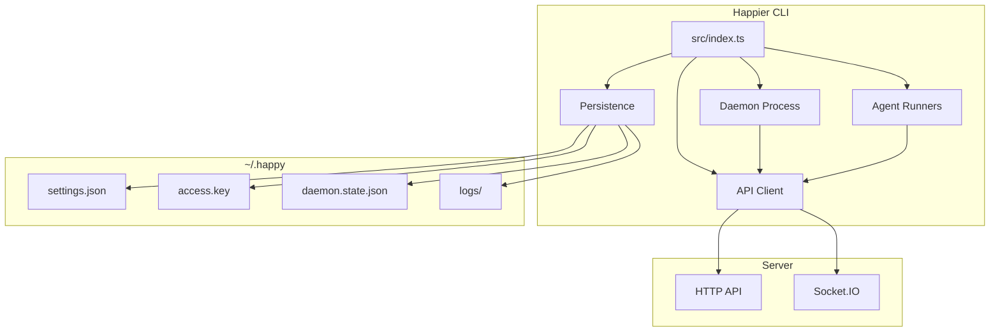

## High-level layout
- **Entry point:** `src/index.ts` parses subcommands and routes execution.
- **API client:** `src/api` handles HTTP + Socket.IO, encryption, and RPC.
- **Daemon:** `src/daemon` runs in the background, spawns sessions, and maintains machine state.
- **Persistence/config:** `src/persistence.ts` + `src/configuration.ts` manage local state in `~/.happy`.
- **Agents:** `src/claude`, `src/codex`, `src/gemini` provide provider-specific runners.

## CLI entry flow

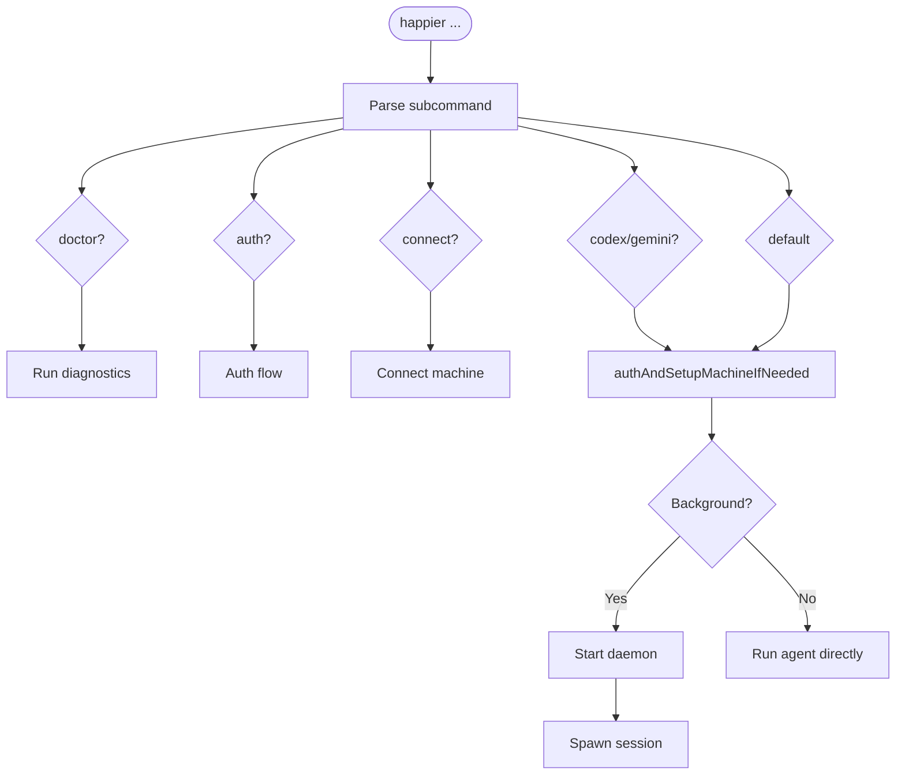

`src/index.ts` is the CLI router. It:
- Parses subcommands (`doctor`, `auth`, `connect`, `codex`, `gemini`, and default run flows).
- Ensures auth and machine setup when needed (`authAndSetupMachineIfNeeded`).
- Starts the daemon or runs an agent directly based on subcommand/context.

## Desktop-driven setup

The desktop app never asks the user to open a terminal to connect the computer it is running on.
It drives the same CLI subcommands the human flow uses, through the bundled `hsetup` sidecar
(`apps/bootstrap`), which the Tauri shell launches (`apps/ui/src-tauri/src/system_tasks/`). `hsetup`
is bundled inside the desktop app, not a separately released component.

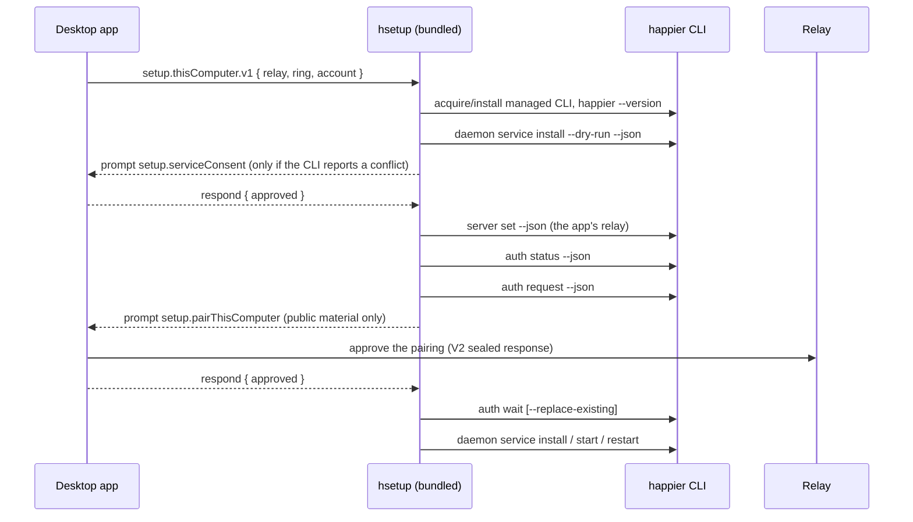

### The interactive-kind seam

`hsetup` has two dispatch paths and a kind belongs to exactly one of them:

- **Interactive kinds** (`createDefaultInteractiveKinds()`, `apps/bootstrap/src/bin/hsetup.ts`) run
  under `createSystemTasksRunner` and can call `ctx.prompt()`, streaming a `prompt` event and
  suspending until the app answers over stdin. `setup.thisComputer.v1` is one.
- **Registry kinds** (`createHsetupSystemTaskRegistry()`, `systemTasks/registry.ts`) run to
  completion without reading stdin; a kind that prompts from there fails `prompt_required`.

`remote.ssh.bootstrapMachine.v1` is deliberately reachable from both maps — the same kind with the
same dependency defaults, exposed interactively for streamed prompts and through the registry for
callers that supply prompt resolutions up front. No other kind appears in both.

The prompt payloads are one wire contract, not a per-side transcription:
`packages/protocol/src/systemTasks/setupThisComputerTaskContract.ts` owns the shapes, the builders
the executor constructs with, and the parsers the app reads with. Prompt event data is redacted by
the runner (`SENSITIVE_PROMPT_DATA_KEY_PATTERNS`), so the pairing prompt carries public material
only: the terminal public key, the relay URL, the comparable key the CLI is actually configured
for, the account the run is pairing this computer to, the CLI's pairing requirement, and how
`hsetup` resolved that CLI. The runner redacts by *key name*, and `relayUrl` is not one of those
names, so the builder strips any `user:pass@` userinfo before the prompt becomes an event —
identity is unaffected because the comparable key ignores userinfo on both sides.

### Managed-CLI install ownership: silent vs attended approval

Approving a pairing hands the requesting CLI the account content key, so the app decides **how** to
approve from install ownership. `apps/bootstrap/src/systemTasks/localFirstPartyCommand.ts` reports
provenance `managed` when this machine's managed install layout claims the binary: the
`current.version` marker that `installVersionedPayload` writes under `~/.happier`, plus the payload
it names under `versions/<versionId>`. Everything else is `override` — an explicit env override
(`HAPPIER_BOOTSTRAP_CLI_PATH`, `HAPPIER_BOOTSTRAP_HAPPIER_PATH`), a repo-local checkout, or a binary
that merely exists at `<installRoot>/current` with no install behind it.

**`managed` is an ownership record, not verified publisher provenance.** The marker is a plain text
file in the user's own home; any process running as the user can write it and the binary beside it.
Release verification (minisign-checked checksums in
`prepareFirstPartyComponentPayloadFromGitHubRelease`) happens at download time and is not re-proved
on resolve. So the fact `managed` establishes is "this app's install path put it there", not "this
binary is official Happier".

That fact is still the right one to act on, because it selects the approval mode rather than
asserting authenticity:

- **`managed`** — `approveSetupPairingForTarget.ts` approves silently, so ordinary first-run
  onboarding is zero-interaction.
- **`override`** — the app asks the person at the keyboard once, naming the resolved binary
  (`apps/ui/sources/setup/presentUnmanagedCliConsent.ts`). Accepting approves; declining refuses
  with `cli_not_approved` and setup is deferred rather than retried. A surface with nobody to ask
  refuses with `cli_not_managed`.

The invariant this preserves is deliberately narrow: **the app must not release the account content
key UNATTENDED to a CLI its own install path did not place.** The identical key is already released,
attended, to any CLI the user pairs by QR code (`useConnectTerminal`), so a hard refusal for
developers and forks running a CLI they built themselves would buy no security — only a dead end.

Approval is also bound to the account: the executor states the `expectedAccountId` it was started
with on the prompt, and the app refuses (`account_mismatch`) when that is absent or is not the
account the app started this run for — the sealed response carries that account's content key. The
account, relay, CLI identity and pairing-requirement checks are **hard** refusals and are all
settled before install ownership is considered, so none of them can be talked past by a dialog.

Later same-user filesystem tampering with an already-installed managed CLI is **explicitly outside
the threat model**: there is no runtime attestation, per-launch hashing, or signed receipt, because
a process running as the user could defeat any of them. `happierCli.ts` additionally enforces one version floor
(`SETUP_CLI_VERSION_FLOOR`) so setup drives a CLI whose command contract it knows; below the floor
a managed CLI is reacquired once and then fails by name, and an override CLI fails immediately
without reacquisition.

### App → CLI, with no ambient fallback

The relay direction is one-way at setup: the **app** tells the CLI which relay to use. The
executor requires an explicit `activeRelayUrl`, `activeWebappUrl`, `expectedAccountId` and
release ring, and fails `invalid_params` before running anything when one is missing. The app's
own server profile id is deliberately *not* part of the spec: the CLI keeps its own profile store,
and the pairing prompt carries the comparable key of the relay the CLI actually configured rather
than an echo of an app-side id. It never reads the CLI's currently configured relay as a fallback — that fallback is
what let setup silently configure the wrong relay. The two stores stay separate on purpose: the
app persists its own server profiles and the CLI persists its own; pairing is the bridge, and
`server set` is the only direction that crosses.

Readiness is never claimed from the executor's success. It is re-read afterwards from
`happier daemon status --json`, whose `runtimeConvergence` block describes the *running* daemon —
authenticated control reachable, the installed service owning that process, machine id and CLI
version matching. Host-visible PID equality is never required, so a daemon in a container whose
PID is hidden still reports ready when its authenticated control answers.

The same response's `service` block carries `targetMode` — `default-following` or `pinned`, read
from the installed service definition's own declaration (its file name is only the fallback for
definitions installed before that declaration existed). It is `null` when no readable definition
proved a mode, and absent from CLIs that predate the field; neither may be read as
`default-following`. "A service is installed" and "a service this app may repoint on its own" are
different facts, and only `targetMode` separates them.

The same block carries `autostart` — `at-login` or `on-demand`, the CLI's own
`DaemonServiceAutostartMode` vocabulary. One reader recovers it
(`readInstalledDaemonServiceAutostartMode`), and on macOS it reads the **platform's own trigger**:
the LaunchAgent's `RunAtLoad`, which is what launchd will actually do, so a hand-edited plist
reports honestly instead of echoing a stale declaration. Linux and Windows keep the declaration the
installer recorded in the definition (`HAPPIER_DAEMON_SERVICE_AUTOSTART`), because their real
trigger is a `systemd` enable symlink / a scheduled-task trigger and reading either needs a
subprocess this synchronous reader runs on the healthy status fast path. It is `null` when nothing
proved a mode, and absent from CLIs that predate the field; as with `targetMode`, neither may be
read as a mode. The whole seam — the status field, the hsetup task param, the desktop hook and the
`--autostart` flag — uses those two words, so nothing between the switch and the service definition
translates a boolean.

Applying a mode is `install`, the CLI's idempotent convergence command. On Linux, when the mode is
the only difference from the installed unit, the plan applies the login trigger
(`systemctl --user enable|disable`) and **skips the restart**: a preference switch must not drop the
daemon the user is working through. macOS and Windows have no equivalent — their trigger lives in
the definition (`RunAtLoad`) or in the registered task, so applying it re-bootstraps
(`launchctl bootout` → `bootstrap` → `kickstart -k`) or re-creates and re-runs the task, which
restarts the daemon. On Windows an `on-demand` task is registered as `schtasks /SC ONCE` with an
explicitly past `/SD` boundary (schtasks has no manual-only schedule) and **without**
`-StartWhenAvailable`, so Task Scheduler can neither reach the trigger nor catch it up as a missed
start; `schtasks /Run` — the CLI's `service start` — remains the only thing that starts it. On macOS
an `on-demand` LaunchAgent also carries **no** `KeepAlive`:
launchd.plist(5) documents `SuccessfulExit` as implying `RunAtLoad`, so keeping it would re-arm the
login start the mode exists to remove — at the deliberate cost of no crash relaunch while
on-demand.

### Desktop control of the background service

Desktop settings carries two switches, and they are not the same switch. **Launch at login** starts
the *app* and is Tauri's own autostart
(`apps/ui/sources/components/settings/desktop/useDesktopAutostart.ts` →
`desktop_set_autostart_enabled`). **Stay reachable in the background** is the *installed service*
(`useDesktopBackgroundServiceAutostart.ts`), and it changes what this computer does when nobody is
signed in at it. Its subtitle says so plainly, because turning it off trades away the capability
Happier exists for: with it off, phone and browser cannot reach this computer once the app closes.

Both directions go through the CLI that owns the service definition, sequenced by two hsetup kinds
that extend the existing `daemon.service.*` family (`apps/bootstrap/src/systemTasks/kinds/daemonService.ts`):

| Kind | CLI command | Proof |
| --- | --- | --- |
| `daemon.service.autostart.set.v1` | `happier daemon service install --autostart=<at-login\|on-demand> --json` | Re-reads `service.autostart`; a CLI that cannot report it fails as `daemon_service_autostart_unsupported`. |
| `daemon.service.stop.v1` | `happier daemon service stop --json` | Re-reads status; a still-running daemon fails as `daemon_service_still_running`. |

Neither kind restates a platform rule — the CLI owns every one of them (INV9) — and neither trusts
a command's own success.

With the service installed `on-demand`, the app stops it as it quits. The main window never closes (it hides
to the tray), so "the app closed" is the app *exiting*, which happens once and never per window.
`src-tauri/src/shutdown.rs` holds that exit exactly once and hands the decision to the webview,
which is the only place that knows what is running here.
`apps/ui/sources/setup/resolveDesktopCloseDaemonDecision.ts` decides: a service that starts at login
(or whose mode is unknown) is left alone; active agent sessions **on this computer** turn the stop
into a question; otherwise the service stops silently. The asymmetry is deliberate — leaving the
daemon running costs nothing the user did not already have, while stopping it can end in-flight
agent work — so the service is only ever stopped by an answer that was actually reached. A force
quit, an OS shutdown or a logout that kills the app part-way through leaves it running, and an
update relaunch never asks at all. Nothing waits on a timer: a quit the webview cannot finish is
finished by pressing Quit again.

**Which quit gestures reach the handoff.** Only `app.exit` produces `RunEvent::ExitRequested`, so a
quit reaches the handoff exactly when it goes through a menu item this app owns. Two menus do, and
both route through one global menu-event router (`src-tauri/src/menu.rs`), registered once at the app
level because muda delivers every menu's events on a single channel — registering it per menu would
call `app.exit` twice for one Quit and the second exit would find the handoff already used:

| Gesture | Platforms | Reaches the handoff |
| --- | --- | --- |
| Tray → **Quit Happier** | macOS, Windows, Linux | Yes |
| App menu → **Quit Happier** / Cmd+Q | macOS | Yes |
| Window close / Alt+F4 / titlebar X | all | No quit at all — the main window hides; the tray brings it back |
| Dock → Quit, OS logout, OS shutdown, force quit | macOS | **No** |
| Taskbar → Close window, session end | Windows | **No** |

On macOS the app builds its own menu rather than using tauri's default, because that default ends in
muda's *predefined* Quit whose action is the native `terminate:` — it emits no menu event and offers
no `prevent_exit`, so it would skip the handoff entirely. The app menu mirrors tauri's default item
for item (About, Services, Hide, Edit, View, Window, Help, keeping tauri's own Window/Help submenu ids
so macOS still gets the window list and Help search) and replaces only Quit. Windows and Linux get no
app menu from tauri at all, which is why the tray is not optional there: it is both their only Quit
and their only way to reopen a window that close merely hid.

The gestures marked **No** terminate the process without an `ExitRequested`, so the background service
is left exactly where it was — the same safe direction as a crash, and the reason the handoff never
stops the service on a path it cannot confirm. An `on-demand` service left running that way is stopped
by the next in-app quit, `happier daemon service stop`, or the settings control.

### What may repoint this computer's daemon

Moving an already-configured background service to a different relay originates from the **direct
Relay/Home action** and nowhere else. The user's durable selection target cannot carry that
meaning — it names their *default* relay, so any navigation-, notification-, deep-link-, voice- or
focus-driven server change that lands back on it is indistinguishable from the user choosing it.
So the direct action records a one-shot in-memory intent
(`apps/ui/sources/setup/directRelaySelectionIntent.ts`) before it switches the connection, and the
authenticated setup gate spends that intent exactly once. Nothing is persisted: an unconsumed
intent is simply forgotten when the app run ends. Group selection records nothing — a group names
several relays and cannot name one daemon target.

A relay change is not the only move: the same relay under a **different account** re-pairs this
computer's service to that account, so it takes the same consent decision rather than ordinary
convergence. That decision (`relayReconciliationConsent.ts`) is silent only when the current facts
prove the service is the app's own **default-following** installation, sitting where the app last
put it, under an account that does not contradict the app's. A `pinned` service, or one whose
`targetMode` is UNKNOWN, is asked about once — and the device-local "always move my
default-following service" preference cannot reach past either.

## Local state and configuration

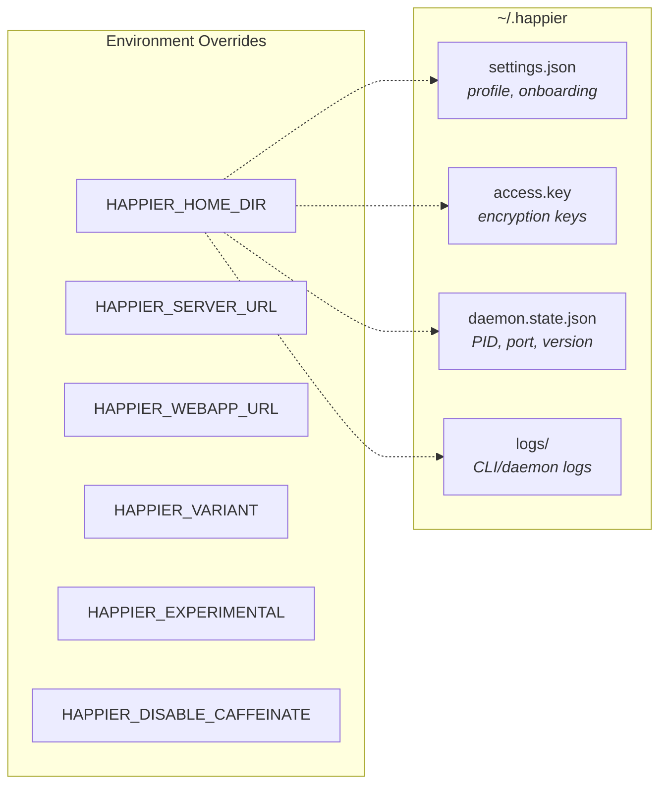

Local state lives under `~/.happier` (or `HAPPIER_HOME_DIR`):
- `settings.json`: onboarding and profile settings (validated/migrated).
- `access.key`: local key material for encryption/auth.
- `daemon.state.json`: daemon PID + control port + version.
- `logs/`: CLI/daemon logs.

Configuration lives in `src/configuration.ts`:
- `HAPPIER_SERVER_URL` and `HAPPIER_WEBAPP_URL` override defaults.
- `HAPPIER_VARIANT`, `HAPPIER_EXPERIMENTAL`, `HAPPIER_DISABLE_CAFFEINATE` control behavior.

## API client architecture

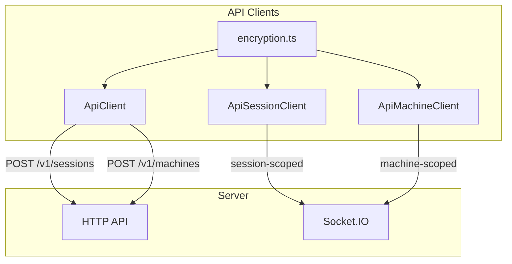

### HTTP
`ApiClient` (`src/api/api.ts`) handles:
- Session creation (`POST /v1/sessions`) with encrypted metadata/state.
- Machine registration (`POST /v1/machines`) with encrypted metadata/daemon state.
- Other CRUD actions through `ApiSessionClient` and `ApiMachineClient`.

### WebSocket

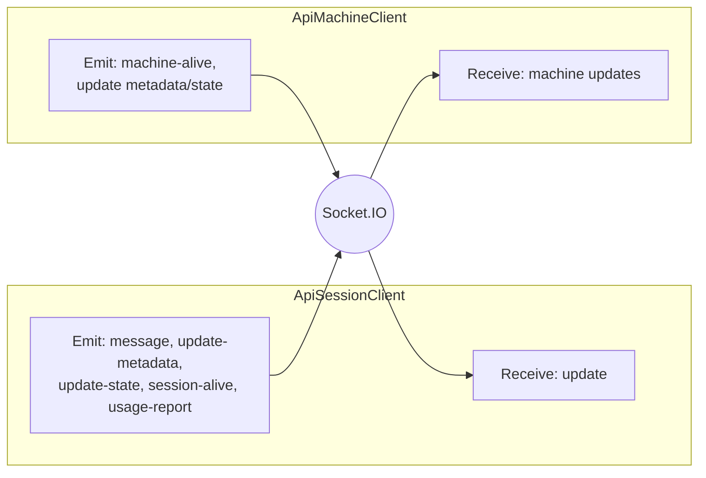

`ApiSessionClient` (`src/api/apiSession.ts`) connects to Socket.IO as a **session-scoped** client:
- Receives `update` events and decrypts message content.
- Emits `message`, `update-metadata`, `update-state`, `session-alive`, and `usage-report`.

`ApiMachineClient` (`src/api/apiMachine.ts`) connects as a **machine-scoped** client:
- Sends `machine-alive` heartbeats.
- Updates machine metadata/daemon state with optimistic concurrency.
- Receives machine updates and merges them locally.

### Encryption

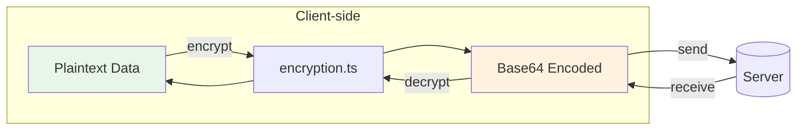

The CLI encrypts client content before it leaves the machine using `src/api/encryption.ts`.
- Session metadata, agent state, messages, machine state, artifacts, and KV values are encrypted client-side.
- On-wire encoding is base64; see `encryption.md`.

## Daemon architecture

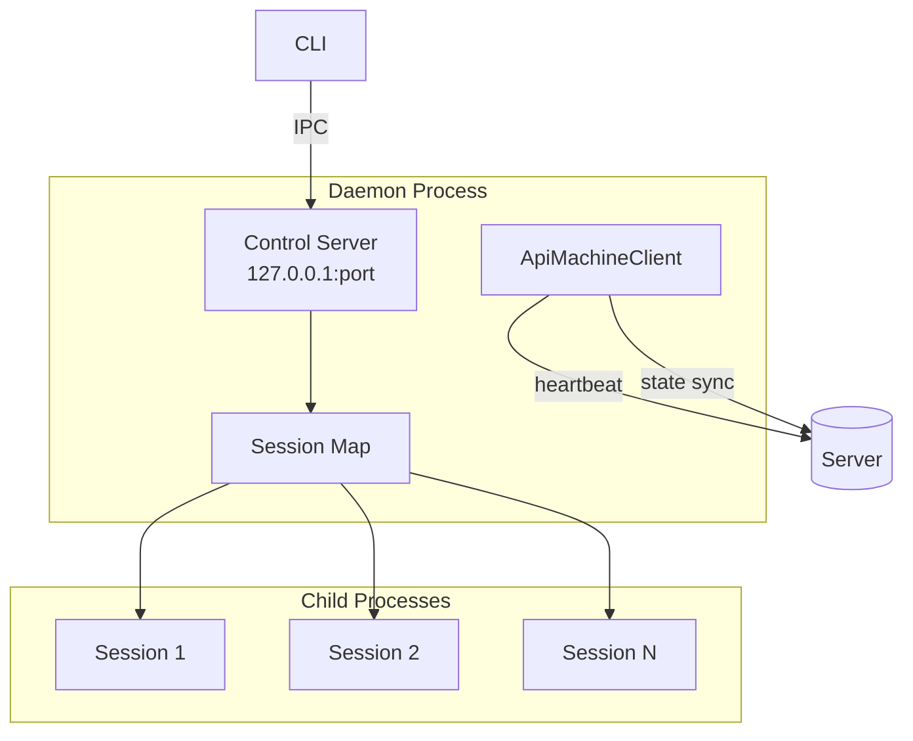

The daemon is a long-lived process responsible for running sessions in the background and maintaining machine presence.

### Lifecycle

1. `startDaemon()` validates the running version and acquires a lock file.
2. It authenticates and registers the machine with the server.
3. It starts a local **control server** for IPC.
4. It keeps a map of tracked child sessions and updates daemon state on the server.

In current development, `createOnChildExited` releases session-marker evidence only
through the tracked exit lifecycle. An exit notification for an untracked PID does
not authorize marker deletion. Failed terminal-exit staging retains tracking and
marker evidence; visible-console startup awaits that cleanup and reports an
incomplete retirement rather than allowing its rejection to escape.

### Model-capacity recovery (development)

`TemporaryThrottleRecoveryScheduler` owns scheduling after a terminal capacity failure.
The Codex adapter reports that terminal failure to host recovery without an extra
immediate retry; native Codex retry-in-progress notifications remain nonterminal.
Consecutive capacity failures wait 5, 10, 20, 40, 80, 160, then 300 seconds before
jitter of ±20%. Provider retry/reset timing is a minimum, not a replacement for
the backoff. The delay is capped, not the number of attempts.

The capacity streak survives continuation handoff. Pending acceptance, a new turn
id, or reconnection is not evidence of model recovery. Only an accepted completed
turn resets the streak. A handed-off continuation has no second retry timer while
its outcome is pending; user cancellation remains authoritative. Authentication,
quota, and non-capacity transport recovery retain their own classifications and
policies.

### Control server (local IPC)

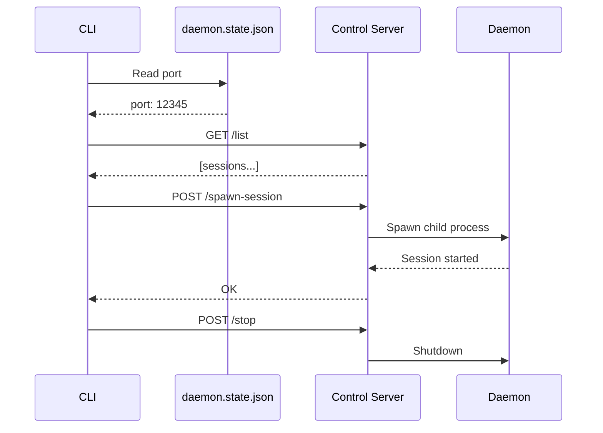

`startDaemonControlServer()` (`src/daemon/controlServer.ts`) runs an HTTP server on `127.0.0.1` and exposes:
- `/list` (list active sessions)
- `/stop-session`
- `/spawn-session`
- `/stop` (shutdown daemon)
- `/session-started` (session self-report)

The CLI talks to this server via `controlClient.ts`, using a port stored in `daemon.state.json`.

### Session spawning

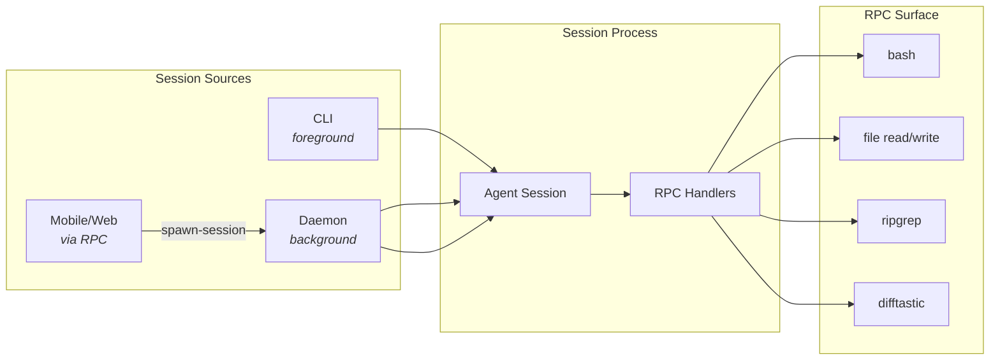

Sessions can be started by:
- The CLI directly (foreground).
- The daemon (background).
- Remote requests over RPC (from mobile/web via machine connection).

Daemon session spawning uses `registerCommonHandlers` to expose a controlled RPC surface (shell commands, file operations, search/diff helpers).

### Machine state

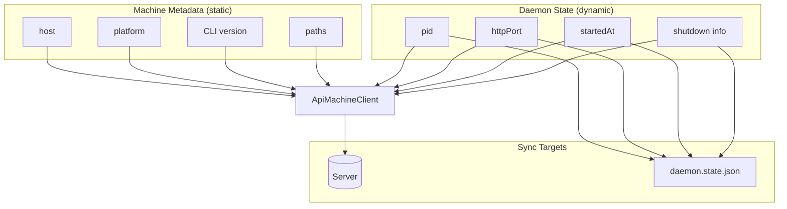

- **Machine metadata** is static info (host, platform, CLI version, paths).
- **Daemon state** is dynamic (pid, httpPort, startedAt, shutdown info).

The daemon updates these via `ApiMachineClient` and mirrors local state into `daemon.state.json` for control/diagnostics.

## RPC and tool bridge

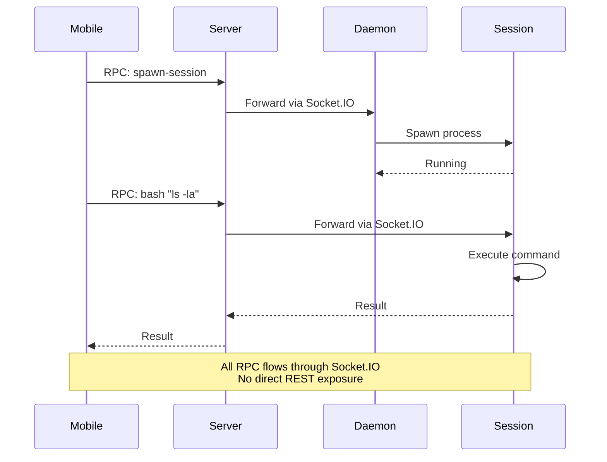

RPC is used to send commands over the Socket.IO connection:
- Sessions register RPC handlers (e.g., `bash`, file read/write, `ripgrep`, `difftastic`).
- The daemon registers a spawn-session handler so the server/mobile client can ask it to start a local session.

This mechanism allows the server and mobile clients to drive local actions without exposing a broad REST surface.

## Implementation references
- CLI entry: `apps/cli/src/index.ts`
- Daemon: `apps/cli/src/daemon`
- Control server/client: `apps/cli/src/daemon/controlServer.ts`, `apps/cli/src/daemon/controlClient.ts`
- Desktop setup executor: `apps/bootstrap/src/systemTasks/kinds/setupThisComputer.ts`
- Desktop setup prompt contract: `packages/protocol/src/systemTasks/setupThisComputerTaskContract.ts`
- Managed-CLI provenance: `apps/bootstrap/src/systemTasks/localFirstPartyCommand.ts`, `apps/bootstrap/src/systemTasks/happierCli.ts`
- Automatic pairing approval: `apps/ui/sources/auth/terminal/approveSetupPairingForTarget.ts`
- Runtime convergence: `apps/cli/src/daemon/statusSnapshot.ts`
- API clients: `apps/cli/src/api`
- Persistence: `apps/cli/src/persistence.ts`
- Config: `apps/cli/src/configuration.ts`
