# CLI Architecture

This document describes the Happier CLI (`apps/cli`) and its daemon. The CLI is both an interactive tool and a background session manager that keeps machine state in sync with the server.

## System overview

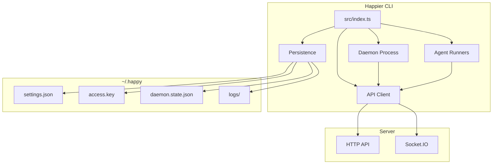

## High-level layout
- **Entry point:** `src/index.ts` parses subcommands and routes execution.
- **API client:** `src/api` handles HTTP + Socket.IO, encryption, and RPC.
- **Daemon:** `src/daemon` runs in the background, spawns sessions, and maintains machine state.
- **Persistence/config:** `src/persistence.ts` + `src/configuration.ts` manage local state in `~/.happy`.
- **Agents:** `src/claude`, `src/codex`, `src/gemini` provide provider-specific runners.

## CLI entry flow

`src/index.ts` is the CLI router. It:
- Parses subcommands (`doctor`, `auth`, `connect`, `codex`, `gemini`, and default run flows).
- Ensures auth and machine setup when needed (`authAndSetupMachineIfNeeded`).
- Starts the daemon or runs an agent directly based on subcommand/context.

## Desktop-driven setup

The desktop app never asks the user to open a terminal to connect the computer it is running on.
It drives the same CLI subcommands the human flow uses, through the bundled `hsetup` sidecar
(`apps/bootstrap`), which the Tauri shell launches (`apps/ui/src-tauri/src/system_tasks/`). `hsetup`
is bundled inside the desktop app, not a separately released component.

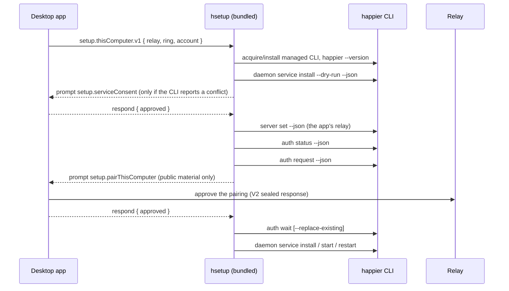

### The interactive-kind seam

`hsetup` has two dispatch paths and a kind belongs to exactly one of them:

- **Interactive kinds** (`createDefaultInteractiveKinds()`, `apps/bootstrap/src/bin/hsetup.ts`) run
  under `createSystemTasksRunner` and can call `ctx.prompt()`, streaming a `prompt` event and
  suspending until the app answers over stdin. `setup.thisComputer.v1` is one.
- **Registry kinds** (`createHsetupSystemTaskRegistry()`, `systemTasks/registry.ts`) run to
  completion without reading stdin; a kind that prompts from there fails `prompt_required`.

`remote.ssh.bootstrapMachine.v1` is deliberately reachable from both maps — the same kind with the
same dependency defaults, exposed interactively for streamed prompts and through the registry for
callers that supply prompt resolutions up front. No other kind appears in both.

Registry handlers can emit live callback progress through their execution context while awaiting
work; these callbacks use the same event validation, redaction, task identity, and timestamps as
yielded events. In current development source, desktop status inspection and explicit setup share
the acquisition producers and the `cli.acquisition.progress` payload owned by
`packages/protocol/src/systemTasks/acquisitionProgress.ts`. See
[Desktop-initiated CLI acquisition](binary-runtime.md#desktop-initiated-cli-acquisition) for its
progress, retry, and cancellation boundaries.

The prompt payloads are one wire contract, not a per-side transcription:
`packages/protocol/src/systemTasks/setupThisComputerTaskContract.ts` owns the shapes, the builders
the executor constructs with, and the parsers the app reads with. Prompt event data is redacted by
the runner (`SENSITIVE_PROMPT_DATA_KEY_PATTERNS`), so the pairing prompt carries public material
only: the terminal public key, the relay URL, the comparable key the CLI is actually configured
for, the account the run is pairing this computer to, the CLI's pairing requirement, and how
`hsetup` resolved that CLI. The runner redacts by *key name*, and `relayUrl` is not one of those
names, so the builder strips any `user:pass@` userinfo before the prompt becomes an event —
identity is unaffected because the comparable key ignores userinfo on both sides.

### Managed-CLI install ownership: silent vs attended approval

Approving a pairing hands the requesting CLI the account content key, so the app decides **how** to
approve from install ownership. `apps/bootstrap/src/systemTasks/localFirstPartyCommand.ts` reports
provenance `managed` when this machine's managed install layout claims the binary: the
`current.version` marker that `installVersionedPayload` writes under `~/.happier`, plus the payload
it names under `versions/<versionId>`. Everything else is `override` — an explicit env override
(`HAPPIER_BOOTSTRAP_CLI_PATH`, `HAPPIER_BOOTSTRAP_HAPPIER_PATH`), a repo-local checkout, or a binary
that merely exists at `<installRoot>/current` with no install behind it.

**`managed` is an ownership record, not verified publisher provenance.** The marker is a plain text
file in the user's own home; any process running as the user can write it and the binary beside it.
Release verification (minisign-checked checksums in
`prepareFirstPartyComponentPayloadFromGitHubRelease`) happens at download time and is not re-proved
on resolve. So the fact `managed` establishes is "this app's install path put it there", not "this
binary is official Happier".

That fact is still the right one to act on, because it selects the approval mode rather than
asserting authenticity:

- **`managed`** — `approveSetupPairingForTarget.ts` approves silently, so ordinary first-run
  onboarding is zero-interaction.
- **`override`** — the app asks the person at the keyboard once, naming the resolved binary
  (`apps/ui/sources/setup/presentUnmanagedCliConsent.ts`). Accepting approves; declining refuses
  with `cli_not_approved` and setup is deferred rather than retried. A surface with nobody to ask
  refuses with `cli_not_managed`.

The invariant this preserves is deliberately narrow: **the app must not release the account content
key UNATTENDED to a CLI its own install path did not place.** The identical key is already released,
attended, to any CLI the user pairs by QR code (`useConnectTerminal`), so a hard refusal for
developers and forks running a CLI they built themselves would buy no security — only a dead end.

Approval is also bound to the account: the executor states the `expectedAccountId` it was started
with on the prompt, and the app refuses (`account_mismatch`) when that is absent or is not the
account the app started this run for — the sealed response carries that account's content key. The
account, relay, CLI identity and pairing-requirement checks are **hard** refusals and are all
settled before install ownership is considered, so none of them can be talked past by a dialog.

Later same-user filesystem tampering with an already-installed managed CLI is **explicitly outside
the threat model**: there is no runtime attestation, per-launch hashing, or signed receipt, because
a process running as the user could defeat any of them. `happierCli.ts` additionally enforces one version floor
(`SETUP_CLI_VERSION_FLOOR`) so setup drives a CLI whose command contract it knows; below the floor
a managed CLI is reacquired once and then fails by name, and an override CLI fails immediately
without reacquisition.

### One default channel per Happier home

A Happier home has one default `happier` command and one default-following background service, and
both belong to the **default release channel** (`default-cli-release-channel.json`; the service runs
that channel's `~/.happier/bin/happier` shim). Two rules keep a second channel from fighting it:

- **Installing another channel never takes the default.** `installVersionedPayload` keeps the
  recorded default channel (marker and `happier` shim) whenever that channel's managed CLI is
  installed; the installed channel only gets its own shim (`hprev`, `hdev`). It becomes the default
  on a first install into an empty home, or when the user chose it explicitly — the official
  installers' `self __install-payload --channel` passes `selectAsDefaultReleaseChannel`. So a desktop
  app, a `self update` or any other acquisition of a second channel never changes which CLI the
  user's terminal and the service run.
- **An app of another channel adopts the default channel's CLI.** hsetup resolves the CLI through
  `resolveLocalHappierCliReleaseRing` (`apps/bootstrap/src/systemTasks/happierCli.ts`): while the
  default channel's managed CLI is installed, a preview app on a stable home drives status, relay,
  pairing and service commands through the stable CLI. Every ownership and version check therefore
  compares the running daemon with the CLI its service actually runs, and the install dry-run never
  proposes replacing the default channel's service. With no managed CLI of the default channel, the
  app's own channel is acquired (and, being the first install, becomes the default). An env override
  (`HAPPIER_BOOTSTRAP_CLI_PATH`) still wins over both.

`daemon.service.status.v1` reports the answering CLI's update state as `cli.update`
(`{ currentVersion, latestVersion, updateAvailable, managed }` plus the K5 facts below, from
`happier daemon status --json` → `cliUpdate` — never a network read on that path; a stale cache is
refreshed by the existing detached `self check`). A `start` issued while the service's own daemon
still runs another CLI version is promoted to `restart` on every platform (`systemctl start` on an
active unit is a no-op).

### One CLI update transaction (plan R13 f)

`runManagedCliUpdate` (`packages/cli-common/src/firstPartyRuntime/runManagedCliUpdate.ts`) is the
only way a managed first-party CLI is updated in place. `happier self update`, the desktop's
bootstrap `cli.update.v1` and the daemon-hosted remote `cli.update.v1` all run it, always from the
version being replaced:

1. **Admission.** The transaction first takes both locks described in step 4 — before it downloads
   anything — so a concurrent update is refused at once and never downloads, and a caller learns
   the attempt was admitted (`onAdmitted`) before it waits for the download. One update per Happier
   home runs at a time; its download is the only one.
2. **One target version.** The ring's newest release (or `--to <exact version>`, tag
   `cli-v<version>`) is resolved once by the acquisition owner
   (`prepareFirstPartyComponentPayloadFromGitHubRelease`, every OS including Windows) and downloaded
   with its minisign-verified checksums; every later step is bound to that version.
3. **Smoke.** The staged executable's `--version` must equal the target, or nothing is activated
   (`cli_update_smoke_failed`).
4. **Capture, then activate without pruning,** under two locks
   (`withFirstPartyPayloadMutationLock.ts`): the install root's (`<installRoot>.mutation.lock`) and
   the home-wide activation lock (`<home>/first-party-activation.lock`), because launchers
   (`<home>/bin`) and the default-channel record are shared by every channel.
   `installVersionedPayload` takes both for any component with launchers or the default-channel
   record. A busy lock fails at once (`FIRST_PARTY_PAYLOAD_MUTATION_IN_PROGRESS`); a lock whose
   holder process died is reclaimed under `<lock>.reclaim`, so two reclaimers can never both remove
   it, and a holder only ever removes its own lock (token). A lock release that fails after the
   outcome is settled never changes it: it is reported as a diagnostic (`onWarning`, stderr by
   default), and the lock left behind names a pid that the next holder reclaims once it has exited.
   The capture
   (`restoreInstalledPayloadState.ts`) records the `current`/`previous` markers (which name the
   pointer targets) and the default-channel record, and moves every launcher the activation will
   rewrite into this transaction's own `<home>/bin/.update-rollback/<id>/` (renaming works on a
   running Windows `.exe` where deleting it does not). If moving one fails, the ones already moved
   are put back first. Nothing removes another transaction's set-aside entries.
5. **Restart and prove,** only when the service's own daemon was running before the update: through
   the CLI service owner (`daemon service restart` run by the activated binary — its ownership wait
   is the budget), then the owner must report the target version. `last-update.json` says
   `pendingReconnect` meanwhile.
6. **Commit** (drop this transaction's set-aside launchers, prune to current + previous) **or
   recover:** restore everything captured, restart the previous binary and prove it, and only then
   report. Rollback happens only when activation or that local proof failed — never because the
   relay is unreachable: a machine that is offline after a good local restart has updated.
   `rolledBack` means the previous daemon is back and proven (or none was running); a restore that
   failed, or a restored version whose service did not come back, is `failed` and says which.
7. **Record every end** in `<installRoot>/last-update.json` (`CliUpdateLastResultSchema`) through
   its one writer — failures before activation included (release, download, verification, unpack,
   smoke; `targetVersion` is `null` only when no release could be resolved). A refusal because
   another update holds the lock records nothing: the record belongs to the attempt in progress. A
   record that cannot be written never blocks recovery; it is reported on stderr (the updater's log
   for a remote update).

**What recovery covers — and what it does not.** Recovery covers activation and restart failures
this process catches. It does **not** cover the updater itself being killed or the machine losing
power mid-transaction (a set-aside directory may then be the only copy of a launcher, which is why
nothing deletes other transactions' entries), it proves the previous binary's compatibility with
state a failing new daemon wrote only for the supported predecessor transition below, and it does
not supervise the service manager beyond the one restart it performs (systemd/launchd/Task
Scheduler restart policy is theirs).

The service decision is one predicate per caller boundary: the CLI plans it from the daemon owner
observed before the update (`planServiceDaemonRestartAfterUpdate`: this channel's own service
label, never a manual daemon or another channel's service); bootstrap reads `daemon status --json`
through `createSelectedCliInvocation` (inherited relay selectors cleared, so the daemon it verifies
is the one the service runs).

**Windows.** The two local paths differ. `happier self update` stops the payload's processes before
activation (`quiesceInstalledCliWindowsPayloadOwners`: `service stop`, `daemon stop --all
--kill-sessions`, `taskkill /T` — **running sessions are ended**), as the installer does. The
desktop's `cli.update.v1` does not pass that step: it relies on the launcher move-aside and does
not end sessions, but it is unverified on a real Windows host. Remote update is disabled on Windows
(below).

**Rolling back across a migration.** The previous version must read whatever the new one wrote
before it failed. Every predecessor that can run this transaction is ≥ 0.2.13 (the transaction
ships in the CLI and in the desktop's hsetup, whose setup floor is 0.2.13), and the persisted
formats a new daemon may migrate at start are forward-tolerant within 0.2 (settings
`SUPPORTED_SCHEMA_VERSION` 6 is unchanged since 0.2.12 and a newer schema only logs a warning). No
0.2 release forbids rollback; the first release whose migration an older reader cannot read must add
a rollback floor to this transaction before it ships.

**K5 — per-machine update facts.** `readCliUpdateFacts` (`apps/cli/src/cli/runtime/update/cliUpdateFacts.ts`,
schema `CliUpdateFactsSchema` in `@happier-dev/protocol`) reports `currentVersion`, the ring-filtered
cached `latestVersion`, `channel`, `installSource` (`managed` only when the running executable is
inside its ring's recorded install; npm/brew name their own update command), `updateCommand`,
`canUpdateRemotely` and `lastUpdate`. Every daemon publishes it in its encrypted machine metadata
as `cliUpdate` on its first connect after start and again whenever `last-update.json` changes
(the daemon watches its install root — no poller; `watchLastCliUpdateResult`), and
`daemon status --json` extends `cliUpdate` with it. The update-check cache has one writer (`self check`, `recordCliUpdateCheck`) and one
ring-filtered reader (`readCachedCliUpdateState`, `packages/cli-common/src/update`) used by the
notice, the status, doctor repair and K5; doctor never writes it or calls npm itself.

**Remote.** The daemon's `tool.systemTasks` capability lists `cli.update.v1` only when
`canUpdateRemotely` (presence = capability; older daemons never list it). The kind starts
`self update` detached from the daemon's own binary (output to `logs/cli-update-<ms>.log`) and
answers `{ started: true, currentVersion, channel, logPath }` only once the updater reported on
its admission pipe (`updaterAdmission.ts`: fd 3, one JSON line, then closed — stdout/stderr stay on
the log) that it holds the locks; an updater refused admission (`cli_update_in_progress`, whose
outcome another attempt owns) or ending before it reports (`cli_update_start_failed`, naming the log)
fails the task instead, so a refused attempt is never shown as started. The updater outlives the
service restart because systemd uses `KillMode=process` and launchd `AbandonProcessGroup`. The
outcome is observed when the machine reconnects: its metadata carries the new (or restored)
version and `lastUpdate`; an attempt that ended without a restart (e.g. the download failed) is
republished by the still-running daemon when the updater records it. npm/Homebrew installs are refused with their exact update command
(`cli_not_managed`). Windows reports `canUpdateRemotely: false`: its update stops the payload's
processes with `taskkill /T`, which would end the updater (a descendant of the daemon), and Task
Scheduler's treatment of a detached descendant across `/End` is unverified.

### App → CLI, with no ambient fallback

The relay direction is one-way at setup: the **app** tells the CLI which relay to use. The
executor requires an explicit `activeRelayUrl`, `activeWebappUrl`, `expectedAccountId` and
release ring, and fails `invalid_params` before running anything when one is missing. The app's
own server profile id is deliberately *not* part of the spec: the CLI keeps its own profile store,
and the pairing prompt carries the comparable key of the relay the CLI actually configured rather
than an echo of an app-side id. It never reads the CLI's currently configured relay as a fallback — that fallback is
what let setup silently configure the wrong relay. The two stores stay separate on purpose: the
app persists its own server profiles and the CLI persists its own; pairing is the bridge, and
`server set` is the only direction that crosses.

Every command a setup run issues goes through one relay context built once from the target
(`createSetupCliScope`, `apps/bootstrap/src/systemTasks/localDaemonCli.ts`, plan R13 a). Both of its
invocations clear every server selector the app process inherited (`HAPPIER_SERVER_URL`,
`HAPPIER_WEBAPP_URL`, `HAPPIER_LOCAL_SERVER_URL`, `HAPPIER_PUBLIC_SERVER_URL`,
`HAPPIER_ACTIVE_SERVER_ID`, `HAPPIER_DAEMON_LIFECYCLE_SCOPE_ID` — a stack/dev launch exports them,
and the CLI prefers an env-selected profile over a URL it does not match), so a launch pinned to one
relay can never preview another and then write to its own. `target` adds the selected relay through
the CLI's env server selection for the reads made before the run may select it; `selected` answers
for this home's persisted selection — before `server set` the relay the default-following service
serves (the lifecycle observation), from `server set` on the target (pairing, service
install/start). One context rule covers reads and writes: every other command bootstrap issues
about this computer — the app's status read `daemon.service.status.v1`, service
start/stop/autostart, `cli.update.v1`'s restart and verification — runs with the same cleared
selectors (`createSelectedCliInvocation`, the default for any invocation without an explicit
environment), so the app proves ready exactly the relay setup wrote even under a stack pin. PATH
exposure keeps the process environment (it is not relay-scoped).

The install dry-run that decides consent runs **before** `server set` (no mutation before consent),
so hsetup scopes it to the relay the app selected through the CLI's env server selection
(`HAPPIER_SERVER_URL`/`HAPPIER_WEBAPP_URL`/`HAPPIER_LOCAL_SERVER_URL`, nothing persisted): ownership,
takeover and conflicts are per-relay facts, and judging them against the CLI's previous relay would
block on a pinned service that does not conflict or offer to take over a manual daemon the apply can
never reach. The same dry-run reports an installed service whose definition would switch between a
user-installed CLI (npm, Homebrew) and the managed CLI — in either direction — as an
`installConflict` with `runtimeReplacement: { current, replacement }`, so the existing service-consent prompt names both
before anything is rewritten; the consented apply rewrites it even where the definition comparator
treats launchers as equivalent (macOS). `service start` / `restart` refresh a drifted definition
(new template arguments, a moved node path) but never make that switch: the same
`describeDaemonServiceRuntimeReplacement` predicate — the launcher crossing the managed install
layout boundary (`isManagedCliDaemonServiceLauncher`: a managed shim or a payload under a channel's
install root) either way — leaves the definition as it is and starts what is installed, so the
desktop's quiet start of a stopped service (D6) runs the CLI the service already runs and any switch
goes through the install dry-run's consent and the strict install.

**One CLI per computer (plan R12).** That consent is asked at most once per decision: when the
executor has asked "Let Happier manage it / Keep my own" (prompt `setup.cliChoice`, before any write;
see [One CLI per computer](binary-runtime.md#one-cli-per-computer-plan-r12)), a recorded **manage**
answer — **manage** or **own** — is the consent for a dry-run whose only change is
`runtimeReplacement` (no competing services, nothing to remove, no takeover), and the apply runs
`--replace-existing` without a second prompt; its failure fails setup rather than being logged and
skipped (plan R13 b). Account and relay consent stay separate. After **Keep my own**,
`resolveManagedDaemonServiceShimPath` returns no managed shim for this Happier home, so the kept
CLI's `service install` targets that CLI itself, and a service that ran the managed shim is reported
as the `runtimeReplacement` toward it and switched by that install — never by a start/restart
refresh. Settings ›
This computer › Command line names the answer ("Managed by Happier" / "Your own — path"), shows the
old copy's removal command after **manage**, and its change action reruns the same setup run with
`reconsiderCli: true`.

`auth status` and the daemon status block of `happier daemon status` name the relay by host and the
signed-in account by its readable label (profile username, else display name) and a short id, and
their JSON carries `accountLabel`/`relayHost` (`auth status`) and `auth.accountLabel` (`daemon
status`), so a person can compare this computer's identity with the app's.

Readiness is never claimed from the executor's success. It is re-read afterwards from
`happier daemon status --json`, whose `runtimeConvergence` block describes the *running* daemon —
authenticated control reachable, the installed service owning that process, machine id and CLI
version matching. Host-visible PID equality is never required, so a daemon in a container whose
PID is hidden still reports ready when its authenticated control answers.

The same response's `service` block carries `targetMode` — `default-following` or `pinned`, read
from the installed service definition's own declaration (its file name is only the fallback for
definitions installed before that declaration existed). It is `null` when no readable definition
proved a mode, and absent from CLIs that predate the field; neither may be read as
`default-following`. "A service is installed" and "a service this app may repoint on its own" are
different facts, and only `targetMode` separates them.

The same block carries `autostart` — `at-login` or `on-demand`, the CLI's own
`DaemonServiceAutostartMode` vocabulary. One reader recovers it
(`readInstalledDaemonServiceAutostartMode`), and on macOS it reads the **platform's own trigger**:
the LaunchAgent's `RunAtLoad`, which is what launchd will actually do, so a hand-edited plist
reports honestly instead of echoing a stale declaration. Linux and Windows keep the declaration the
installer recorded in the definition (`HAPPIER_DAEMON_SERVICE_AUTOSTART`), because their real
trigger is a `systemd` enable symlink / a scheduled-task trigger and reading either needs a
subprocess this synchronous reader runs on the healthy status fast path. It is `null` when nothing
proved a mode, and absent from CLIs that predate the field; as with `targetMode`, neither may be
read as a mode. The whole seam — the status field, the hsetup task param, the desktop hook and the
`--autostart` flag — uses those two words, so nothing between the switch and the service definition
translates a boolean.

Applying a mode is `install`, the CLI's idempotent convergence command. On Linux, when the mode is
the only difference from the installed unit, the plan applies the login trigger
(`systemctl --user enable|disable`) and **skips the restart**: a preference switch must not drop the
daemon the user is working through. macOS and Windows have no equivalent — their trigger lives in
the definition (`RunAtLoad`) or in the registered task, so applying it re-bootstraps
(`launchctl bootout` → `bootstrap` → `kickstart -k`) or re-creates and re-runs the task, which
restarts the daemon. On Windows an `on-demand` task is registered as `schtasks /SC ONCE` with an
explicitly past `/SD` boundary (schtasks has no manual-only schedule) and **without**
`-StartWhenAvailable`, so Task Scheduler can neither reach the trigger nor catch it up as a missed
start; `schtasks /Run` — the CLI's `service start` — remains the only thing that starts it. On macOS
an `on-demand` LaunchAgent also carries **no** `KeepAlive`:
launchd.plist(5) documents `SuccessfulExit` as implying `RunAtLoad`, so keeping it would re-arm the
login start the mode exists to remove — at the deliberate cost of no crash relaunch while
on-demand.

### Desktop control of the background service

Desktop settings carries two switches, and they are not the same switch. **Launch at login** starts
the *app* and is Tauri's own autostart
(`apps/ui/sources/components/settings/desktop/useDesktopAutostart.ts` →
`desktop_set_autostart_enabled`). **Stay reachable in the background** is the *installed service*
(`useDesktopBackgroundServiceAutostart.ts`), and it changes what this computer does when nobody is
signed in at it. Its subtitle says so plainly, because turning it off trades away the capability
Happier exists for: with it off, phone and browser cannot reach this computer once the app closes.

Both directions go through the CLI that owns the service definition, sequenced by two hsetup kinds
that extend the existing `daemon.service.*` family (`apps/bootstrap/src/systemTasks/kinds/daemonService.ts`):

| Kind | CLI command | Proof |
| --- | --- | --- |
| `daemon.service.autostart.set.v1` | `happier daemon service install --autostart=<at-login\|on-demand> --json` | Re-reads `service.autostart`; a CLI that cannot report it fails as `daemon_service_autostart_unsupported`. |
| `daemon.service.stop.v1` | `happier daemon service stop --json` | Re-reads status; a still-running daemon fails as `daemon_service_still_running`. |

Neither kind restates a platform rule — the CLI owns every one of them (INV9) — and neither trusts
a command's own success.

With the service installed `on-demand`, the app stops it as it quits. The main window never closes (it hides
to the tray), so "the app closed" is the app *exiting*, which happens once and never per window.
`src-tauri/src/shutdown.rs` holds that exit exactly once and hands the decision to the webview,
which is the only place that knows what is running here.
`apps/ui/sources/setup/resolveDesktopCloseDaemonDecision.ts` decides: a service that starts at login
(or whose mode is unknown) is left alone; active agent sessions **on this computer** turn the stop
into a question; otherwise the service stops silently. The asymmetry is deliberate — leaving the
daemon running costs nothing the user did not already have, while stopping it can end in-flight
agent work — so the service is only ever stopped by an answer that was actually reached. A force
quit, an OS shutdown or a logout that kills the app part-way through leaves it running, and an
update relaunch never asks at all. Nothing waits on a timer: a quit the webview cannot finish is
finished by pressing Quit again.

**Which quit gestures reach the handoff.** Only `app.exit` produces `RunEvent::ExitRequested`, so a
quit reaches the handoff exactly when it goes through a menu item this app owns. Two menus do, and
both route through one global menu-event router (`src-tauri/src/menu.rs`), registered once at the app
level because muda delivers every menu's events on a single channel — registering it per menu would
call `app.exit` twice for one Quit and the second exit would find the handoff already used:

| Gesture | Platforms | Reaches the handoff |
| --- | --- | --- |
| Tray → **Quit Happier** | macOS, Windows, Linux | Yes |
| App menu → **Quit Happier** / Cmd+Q | macOS | Yes |
| Window close / Alt+F4 / titlebar X | all | No quit at all — the main window hides; the tray brings it back |
| Dock → Quit, OS logout, OS shutdown, force quit | macOS | **No** |
| Taskbar → Close window, session end | Windows | **No** |

On macOS the app builds its own menu rather than using tauri's default, because that default ends in
muda's *predefined* Quit whose action is the native `terminate:` — it emits no menu event and offers
no `prevent_exit`, so it would skip the handoff entirely. The app menu mirrors tauri's default item
for item (About, Services, Hide, Edit, View, Window, Help, keeping tauri's own Window/Help submenu ids
so macOS still gets the window list and Help search) and replaces only Quit. Windows and Linux get no
app menu from tauri at all, which is why the tray is not optional there: it is both their only Quit
and their only way to reopen a window that close merely hid. The tray itself is only the Happier
mark, with no title and no status colour: a template image on macOS, and on Windows and Linux the
full-colour mark on a light tray or a white silhouette on a dark one (Windows reads the taskbar's
system mode, Linux the settings portal's `color-scheme`, unknown meaning dark); clicking it on any
platform opens its menu: a disabled status line (`label · detail` from `buildDesktopTrayState`),
**Open Happier**, and **Quit Happier** (`src-tauri/src/tray.rs`).

The gestures marked **No** terminate the process without an `ExitRequested`, so the background service
is left exactly where it was — the same safe direction as a crash, and the reason the handoff never
stops the service on a path it cannot confirm. An `on-demand` service left running that way is stopped
by the next in-app quit, `happier daemon service stop`, or the settings control.

### What may repoint this computer's daemon

Moving an already-configured background service to a different relay originates from the **direct
Relay/Home action** and nowhere else. The user's durable selection target cannot carry that
meaning — it names their *default* relay, so any navigation-, notification-, deep-link-, voice- or
focus-driven server change that lands back on it is indistinguishable from the user choosing it.
So the direct action records a one-shot in-memory intent
(`apps/ui/sources/setup/directRelaySelectionIntent.ts`) before it switches the connection, and the
desktop setup lifecycle spends that intent exactly once. Nothing is persisted: an unconsumed
intent is simply forgotten when the app run ends. Group selection records nothing — a group names
several relays and cannot name one daemon target.

A relay change is not the only move: a daemon validated for a **different account** than the one
the app is on now loses this computer when the executor claims it with `--replace-existing`, whoever
set it up — the app's own service, a manual daemon, or a CLI signed in from a terminal with no
service at all. So an account move always asks, names both accounts, and says the other account will
no longer reach this computer; it is measured against the app's **current** account (signing out of
A and into C in one run still asks), and it is asked on an explicit "Connect this computer here" too
(`desktopSetupCoordinator.startSetup`). The executor is the enforcement point: **before any write** (before `server set` and
PATH exposure) it reads `auth status` for the target relay's saved credentials — the ones
`--replace-existing` would replace — through the same `target` invocation as the dry-run (the CLI resolves
the persisted profile matching `HAPPIER_SERVER_URL` and its credential directory), and when they are
validated for another account (`setupReplacesValidatedAccount`,
`@happier-dev/protocol`, the one rule the app's early question also uses) it asks through the
`setup.accountConsent` prompt, answered by the app's one account question, and stops with
`account_consent_declined` when kept — the terminal's relay, credentials and service are untouched.
If the credentials read after `server set` belong to yet another account (signed in meanwhile), it
stops with `account_changed_during_setup` before pairing. That covers every fact the app could not see before the run:
an ambient read the relay did not answer (the coordinator also re-reads such facts before deciding),
a terminal signed in again since, or saved credentials of another relay. When the app already asked,
the run carries `replaceAccountId` for exactly that account, so only a different account is asked
again. The relay decision (`relayReconciliationConsent.ts`) is silent
only when the current facts prove the service is the app's own **default-following** installation,
sitting where the app last put it; its question names both relay hosts. A `pinned` service, or one
whose `targetMode` is UNKNOWN, is asked about — and the device-local "always move my
default-following service" preference cannot reach past either, nor past any account move.

"Keep it as is" is remembered on this device for the daemon it was said about — its relay and
validated account — through the same device-local settings owner as "always move". While the daemon
still has that identity, relaunches and later reconciliations neither ask again nor show the setup
panel; the drift card ("Connect this computer here") is the way back. A daemon that moves or signs
in as someone else is a new question.

Every blocked setup state also offers **Continue without this computer**: the panel steps aside
through the same decline path a "keep" answer takes, nothing claims ready, and the next launch tries
again. A stopped service that is otherwise the app's own — on-demand after the last quit, or at-login
and stopped by something else — gets the same quiet start with nothing on screen; only a service
that still does not converge afterwards reaches the executor.

### Desktop setup never blocks the app

After sign-in, and on every relaunch, the desktop app opens straight away. Setting up this computer
runs beside it and never holds accounts, other machines, sessions or settings behind it.

- **One lifecycle, at the shell.** `DesktopLocalSetupRuntime` (`apps/ui/sources/setup/`) is mounted
  once by the root layout for an authenticated desktop window (never in the pet overlay, never
  before sign-in). It drives `useDesktopLocalSetupGate` — inspection, the quiet start,
  reconciliation, the executor and the readiness proof — whichever route the app opened on, so a
  cold deep link into a session or Settings gets the same app-open work as the Home. Sign-out
  unmounts it.
- **Presentation on the Home.** `DesktopLocalSetupPanel` docks the setup surface (progress, an
  honest failure sentence, Retry or Update, Continue without this computer, Details) under the Home
  content. It owns no state: leaving the Home never pauses setup, and returning shows the same run.
  The panel never takes keyboard focus; its sentence is announced through a polite live region.
- **Consent** is asked by the operation that needs it, as the existing focused alerts; declining
  leaves the daemon untouched and the app usable.
- **Fails closed.** Readiness still needs converged facts and one successful read-only machine RPC.
  Until then this computer is not declared ready, and the panel says why. A failed first setup is
  never silently optional: the panel stays, and setup runs again on the next launch.
- Starting a session on this computer before it is ready uses the existing entry: with no machine,
  `/new` shows the getting-started guidance whose "Set up this computer" opens
  Settings › This computer.

## Local state and configuration

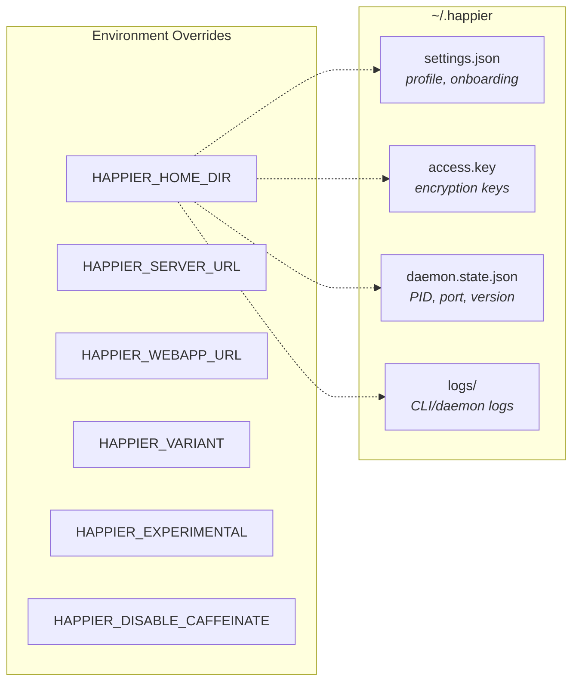

Local state lives under `~/.happier` (or `HAPPIER_HOME_DIR`):
- `settings.json`: onboarding and profile settings (validated/migrated).
- `access.key`: local key material for encryption/auth.
- `daemon.state.json`: daemon PID + control port + version.
- `logs/`: CLI/daemon logs.

Configuration lives in `src/configuration.ts`:
- `HAPPIER_SERVER_URL` and `HAPPIER_WEBAPP_URL` override defaults.
- `HAPPIER_VARIANT`, `HAPPIER_EXPERIMENTAL`, `HAPPIER_DISABLE_CAFFEINATE` control behavior.

## API client architecture

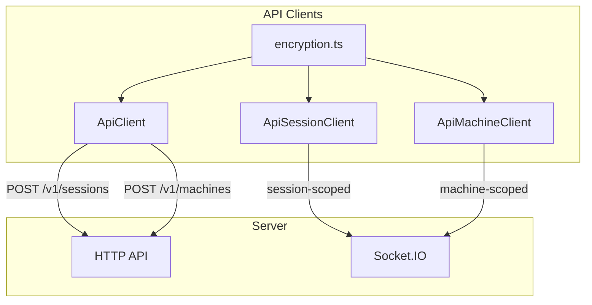

### HTTP
`ApiClient` (`src/api/api.ts`) handles:
- Session creation (`POST /v1/sessions`) with encrypted metadata/state.
- Machine registration (`POST /v1/machines`) with encrypted metadata/daemon state.
- Other CRUD actions through `ApiSessionClient` and `ApiMachineClient`.

### WebSocket

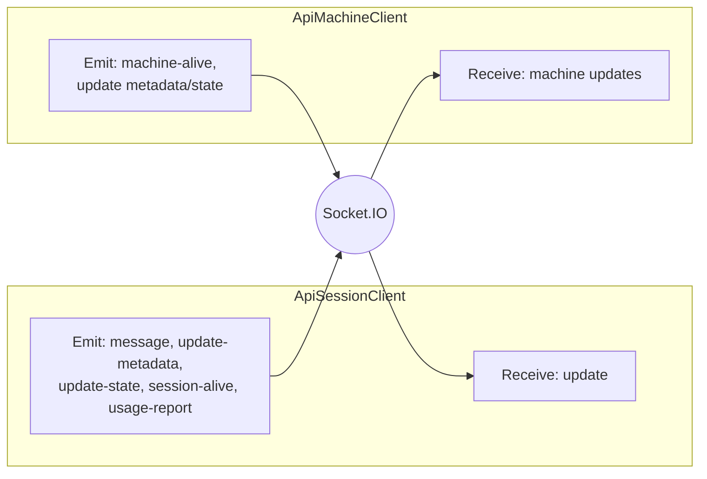

`ApiSessionClient` (`src/api/apiSession.ts`) connects to Socket.IO as a **session-scoped** client:
- Receives `update` events and decrypts message content.
- Emits `message`, `update-metadata`, `update-state`, `session-alive`, and `usage-report`.

`ApiMachineClient` (`src/api/apiMachine.ts`) connects as a **machine-scoped** client:
- Sends `machine-alive` heartbeats.
- Updates machine metadata/daemon state with optimistic concurrency.
- Receives machine updates and merges them locally.

### Encryption

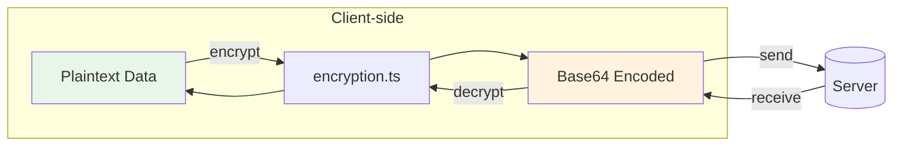

The CLI encrypts client content before it leaves the machine using `src/api/encryption.ts`.
- Session metadata, agent state, messages, machine state, artifacts, and KV values are encrypted client-side.
- On-wire encoding is base64; see `encryption.md`.

## Daemon architecture

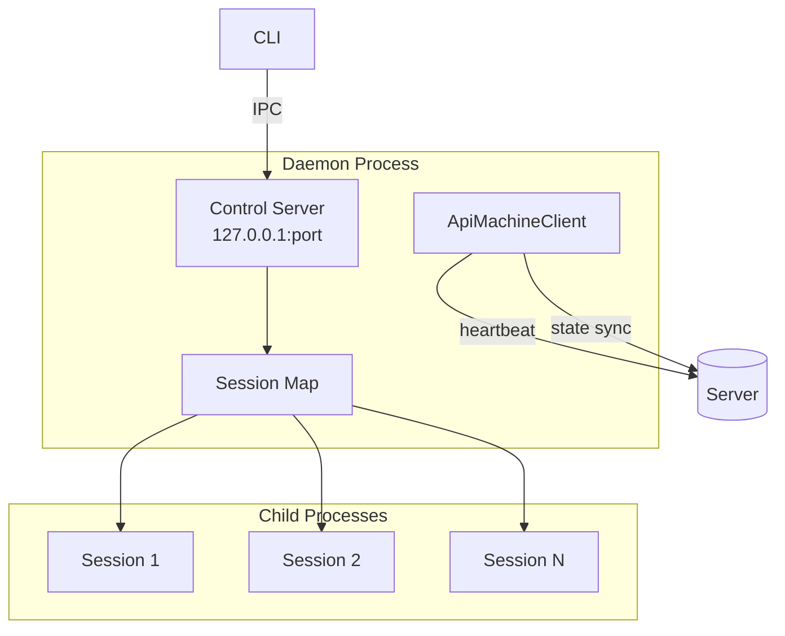

The daemon is a long-lived process responsible for running sessions in the background and maintaining machine presence.

### Lifecycle

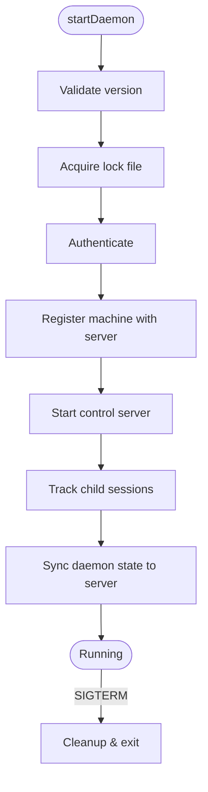

1. `startDaemon()` validates the running version and acquires a lock file.
2. It authenticates and registers the machine with the server.
3. It starts a local **control server** for IPC.
4. It keeps a map of tracked child sessions and updates daemon state on the server.

In current development, `createOnChildExited` releases session-marker evidence only
through the tracked exit lifecycle. An exit notification for an untracked PID does
not authorize marker deletion. Failed terminal-exit staging retains tracking and
marker evidence; visible-console startup awaits that cleanup and reports an
incomplete retirement rather than allowing its rejection to escape.

### Model-capacity recovery (development)

`TemporaryThrottleRecoveryScheduler` owns scheduling after a terminal capacity failure.
The Codex adapter reports that terminal failure to host recovery without an extra
immediate retry; native Codex retry-in-progress notifications remain nonterminal.
Consecutive capacity failures wait 5, 10, 20, 40, 80, 160, then 300 seconds before
jitter of ±20%. Provider retry/reset timing is a minimum, not a replacement for
the backoff. The delay is capped, not the number of attempts.

The capacity streak survives continuation handoff. Pending acceptance, a new turn
id, or reconnection is not evidence of model recovery. Only an accepted completed
turn resets the streak. A handed-off continuation has no second retry timer while
its outcome is pending; user cancellation remains authoritative. Authentication,
quota, and non-capacity transport recovery retain their own classifications and
policies.

### Control server (local IPC)

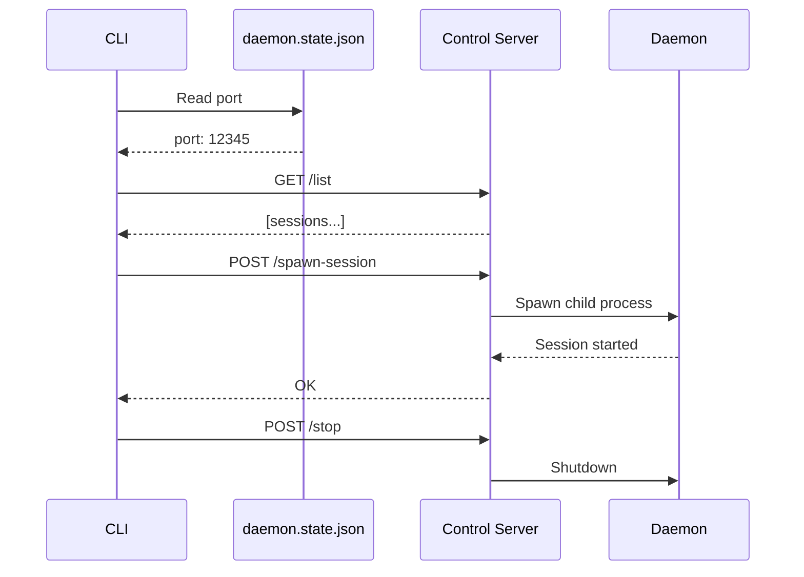

`startDaemonControlServer()` (`src/daemon/controlServer.ts`) runs an HTTP server on `127.0.0.1` and exposes:
- `/list` (list active sessions)
- `/stop-session`
- `/spawn-session`
- `/stop` (shutdown daemon)
- `/session-started` (session self-report)

The CLI talks to this server via `controlClient.ts`, using a port stored in `daemon.state.json`.

### Session spawning

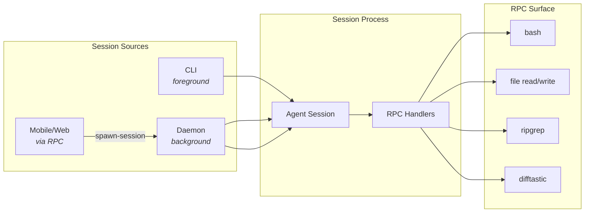

Sessions can be started by:
- The CLI directly (foreground).
- The daemon (background).
- Remote requests over RPC (from mobile/web via machine connection).

Daemon session spawning uses `registerCommonHandlers` to expose a controlled RPC surface (shell commands, file operations, search/diff helpers).

### Machine state

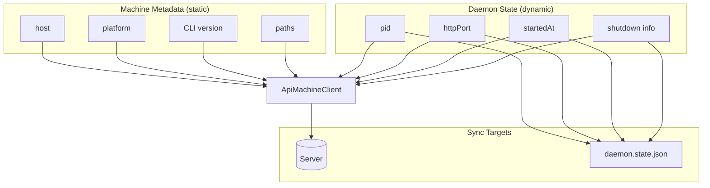

- **Machine metadata** is static info (host, platform, CLI version, paths).
- **Daemon state** is dynamic (pid, httpPort, startedAt, shutdown info).

The daemon updates these via `ApiMachineClient` and mirrors local state into `daemon.state.json` for control/diagnostics.

## RPC and tool bridge

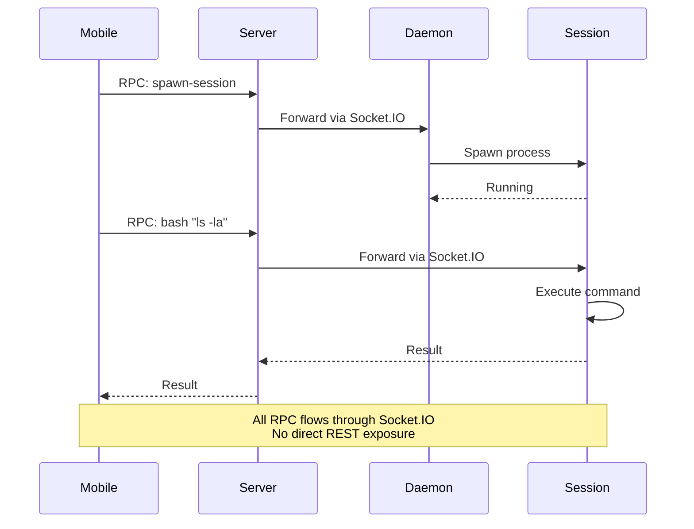

RPC is used to send commands over the Socket.IO connection:
- Sessions register RPC handlers (e.g., `bash`, file read/write, `ripgrep`, `difftastic`).
- The daemon registers a spawn-session handler so the server/mobile client can ask it to start a local session.

This mechanism allows the server and mobile clients to drive local actions without exposing a broad REST surface.

## Implementation references
- CLI entry: `apps/cli/src/index.ts`
- Daemon: `apps/cli/src/daemon`
- Control server/client: `apps/cli/src/daemon/controlServer.ts`, `apps/cli/src/daemon/controlClient.ts`
- Desktop setup executor: `apps/bootstrap/src/systemTasks/kinds/setupThisComputer.ts`
- Desktop setup prompt contract: `packages/protocol/src/systemTasks/setupThisComputerTaskContract.ts`
- Managed-CLI provenance: `apps/bootstrap/src/systemTasks/localFirstPartyCommand.ts`, `apps/bootstrap/src/systemTasks/happierCli.ts`
- Automatic pairing approval: `apps/ui/sources/auth/terminal/approveSetupPairingForTarget.ts`
- Runtime convergence: `apps/cli/src/daemon/statusSnapshot.ts`
- API clients: `apps/cli/src/api`
- Persistence: `apps/cli/src/persistence.ts`
- Config: `apps/cli/src/configuration.ts`
